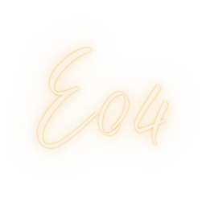

# EO4 標題改用圖片 🖼️

**更新日期**: 2025年10月4日  
**原因**: 解決手寫字體在某些手機上無法正確顯示的問題

---

## 🔄 主要變更

### 問題
- 手寫字體 (Brush Script MT, Lucida Handwriting 等) 在某些手機系統上可能不存在
- 不同系統的 cursive 回退字體差異很大
- 可能導致 EO4 在部分裝置上顯示為系統預設字體

### 解決方案
✅ **將 EO4 文字改為圖片**
- 使用 `e04_title.png` 圖片替代文字
- 確保所有裝置都能看到一致的視覺效果
- 保留相同的發光和動畫效果

---

## 📝 修改內容

### 1. HTML 變更

**修改前:**
```html
<div class="hero-logo" data-aos="fade-down" data-aos-duration="1000">
    <h1 class="hero-title">EO4</h1>
</div>
```

**修改後:**
```html
<div class="hero-logo" data-aos="fade-down" data-aos-duration="1000">
    
</div>
```

### 2. CSS 新增樣式

```css
.hero-title-img {
    max-width: 500px;
    width: 100%;
    height: auto;
    margin-bottom: var(--spacing-lg);
    
    /* 柔和的發光效果 */
    filter: drop-shadow(0 0 8px rgba(184, 134, 11, 0.35))
            drop-shadow(0 0 20px rgba(184, 134, 11, 0.25))
            drop-shadow(0 8px 25px rgba(0, 0, 0, 0.4));
    
    /* 脈動動畫 */
    animation: img-glow-pulse 4s ease-in-out infinite;
}
```

### 3. 響應式尺寸

| 螢幕尺寸 | 圖片最大寬度 |
|---------|-------------|
| 桌面 (>1024px) | 500px |
| 平板 (768-1024px) | 400px |
| 手機橫向 (481-767px) | 300px |
| 手機直向 (<480px) | 250px |
| 橫屏模式 | 220px |

---

## ✨ 保留的效果

即使改用圖片，仍保留以下視覺效果：

1. **柔和發光** ✨
   - 多層 drop-shadow
   - 金色光暈效果

2. **脈動動畫** 💫
   - 4秒循環
   - 微妙的縮放 (1.005)
   - 發光強度變化

3. **響應式設計** 📱
   - 不同螢幕自動調整大小
   - 保持比例不變形

---

## 🎨 視覺一致性

### 優點

✅ **跨平台一致**
- 所有裝置看到相同的 EO4 設計
- 不受系統字體影響

✅ **品牌視覺**
- 完全符合海報設計
- 手寫風格 100% 保留

✅ **載入速度**
- PNG 圖片可優化壓縮
- 單一檔案快速載入

✅ **SEO 友善**
- 圖片有 alt="EO4" 屬性
- 搜尋引擎可識別

---

## 📂 需要的圖片

**檔案位置:**
```
assets/images/e04_title.png
```

**建議規格:**
- 尺寸: 1000px 寬度以上 (高解析度)
- 格式: PNG (支援透明背景)
- 背景: 透明
- 色彩: 金色系 (符合網站主題)
- 風格: 手寫/書法風格

**製作建議:**
1. 使用你海報上的 EO4 字體
2. 去背處理
3. 匯出為高解析度 PNG
4. 可以加入輕微陰影或發光效果（CSS 也會再加）

---

## 🔧 修改的檔案

1. **index.html**
   - 第 112 行: 將 `<h1>` 改為 ``

2. **css/styles.css**
   - 新增 `.hero-title-img` 樣式
   - 新增 `@keyframes img-glow-pulse` 動畫
   - 保留 `.hero-title` 作為備用

3. **css/responsive.css**
   - 平板版: `.hero-title-img { max-width: 400px; }`
   - 手機橫向: `.hero-title-img { max-width: 300px; }`
   - 手機直向: `.hero-title-img { max-width: 250px; }`
   - 橫屏模式: `.hero-title-img { max-width: 220px; }`

---

## ✅ 檢查清單

上線前請確認:

- [ ] `e04_title.png` 已放入 `assets/images/` 資料夾
- [ ] 圖片為透明背景 PNG
- [ ] 圖片解析度夠高（建議 1000px 以上）
- [ ] 在桌面瀏覽器測試顯示正常
- [ ] 在手機測試顯示正常
- [ ] 發光和動畫效果正常
- [ ] 響應式縮放正常

---

## 🚀 部署

修改完成後:

```bash
git add .
git commit -m "改用圖片顯示 EO4 標題，解決手機字體相容性問題"
git push origin main
```

---

## 💡 補充說明

### 為什麼不用 Web Fonts?

雖然可以上傳自訂字體檔案使用 `@font-face`，但:
- ❌ 需要有字體授權
- ❌ 增加額外的字體檔案載入
- ❌ 可能有跨域問題
- ✅ **圖片更簡單直接**

### 圖片 vs 文字的權衡

| 方面 | 文字 | 圖片 |
|------|------|------|
| SEO | 較好 | 需加 alt |
| 可選取/複製 | 可以 | 不行 |
| 縮放品質 | 完美 | 需高解析度 |
| 字體相容性 | ❌ 問題 | ✅ 完美 |
| 載入速度 | 快 | 稍慢 |
| 維護性 | 易 | 需重製圖片 |

**結論**: 對於品牌標題，使用圖片是更穩妥的選擇 ✅

---

**更新完成！** 🎉  
現在 EO4 標題將以圖片形式顯示，確保所有裝置都能看到一致的視覺效果！
